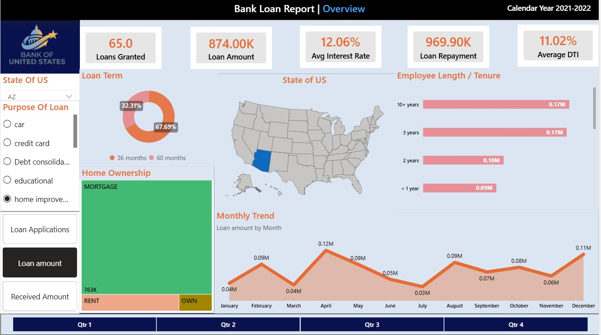
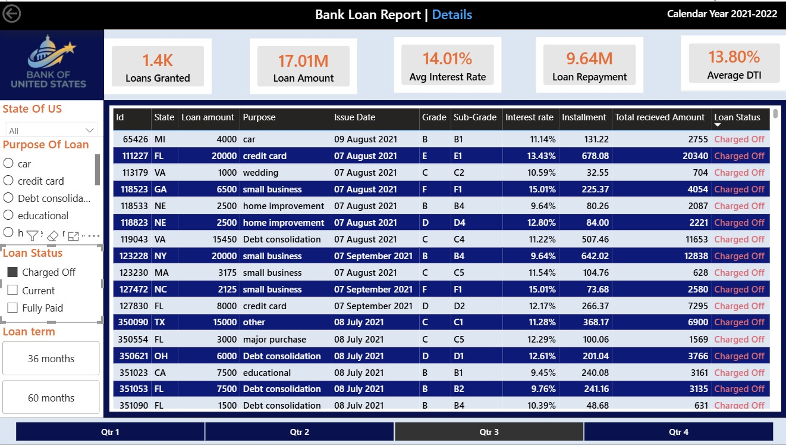

<div align="center">


# 🏦 Bank Credit Risk & Lending Operations Analytics

### SQL + Power BI | Credit Risk | Lending Operations | Business Intelligence

**Transforming loan data into actionable insights for lending performance, credit-risk monitoring and portfolio management.**

</div>

---

# 📌 Project Overview

This project analyzes **bank lending and credit-risk data** using **Microsoft SQL Server and Power BI** to evaluate loan performance, lending trends, borrower characteristics, repayment behavior and credit risk.

The project follows an end-to-end Business Intelligence workflow:

**Raw Loan Data → SQL Analysis → KPI Validation → Power BI Data Model → Interactive Dashboard → Business Insights**

SQL was first used to answer key business questions and independently calculate important KPIs.

The resulting SQL outputs were then used to **cross-check and validate the Power BI calculations and visualizations**, helping ensure that the final dashboard accurately represented the underlying data.

---

# 🎯 Project Objective

The primary objective of this project is to provide a comprehensive view of the bank's lending portfolio and answer important business questions related to:

* 📊 Lending performance
* 💰 Loan funding and repayments
* ✅ Good loan performance
* ⚠️ Bad loan / credit risk
* 📈 Monthly lending trends
* 🗺️ State-wise lending activity
* 🎯 Loan-purpose performance
* ⏳ Loan-term preferences
* 👨‍💼 Employee tenure
* 🏠 Home ownership
* 💳 Loan status and portfolio quality

The ultimate goal is to convert raw loan-level data into a **decision-support dashboard** that can help banking and lending teams monitor portfolio performance and identify potential areas of risk and opportunity.

---

# 💼 Business Problems

The analysis focuses on three major business areas:

### 1️⃣ Lending Performance

Understanding the overall volume of loans issued, total funded amount, repayments received and lending trends.

### 2️⃣ Credit Risk

Measuring Good Loans vs. Bad Loans and monitoring the proportion and financial impact of charged-off loans.

### 3️⃣ Portfolio & Customer Segmentation

Understanding lending patterns across states, loan purposes, loan terms, employment tenure and home ownership.

---

# ❓ Business Questions Covered

## 📊 Core Lending KPIs

1. What is the total number of loan applications?
2. What is the total funded loan amount?
3. What is the total amount received through repayments?
4. What is the average interest rate?
5. What is the average Debt-to-Income (DTI) ratio?

---

## ✅ Good Loan Analysis

6. What percentage of loans are classified as Good Loans?
7. How many Good Loan applications were issued?
8. What is the total amount funded through Good Loans?
9. How much repayment has been received from Good Loans?

---

## ⚠️ Bad Loan / Credit Risk Analysis

10. How many Bad Loan applications exist?
11. What percentage of loans are classified as Bad Loans?
12. What is the total amount funded through Bad Loans?
13. How much repayment has been received from Bad Loans?
14. How does loan performance differ across individual loan statuses?

---

## 📈 Lending Trend & Portfolio Analysis

15. How does loan issuance change month over month?
16. Which states contribute the highest lending activity?
17. Which loan term is most commonly selected?
18. How does lending vary according to employee working tenure?
19. Which loan purposes generate the highest lending volume?
20. How does lending vary across different home ownership categories?

---

# 🛠️ Tools & Technologies

| Tool / Technology                | Purpose                                         |
| -------------------------------- | ----------------------------------------------- |
| 🗄️ Microsoft SQL Server / SSMS  | Data exploration, analysis and KPI calculations |
| 📊 Power BI                      | Interactive dashboard and data visualization    |
| 🧮 DAX                           | Dynamic measures and KPI calculations           |
| 🔄 Power Query                   | Data preparation and transformation             |
| 🧩 Data Modelling                | Structuring data for analytical reporting       |
| 🎛️ Slicers                      | Interactive filtering and segmentation          |
| 🔎 Filters                       | Focused analysis of specific segments           |
| ⚙️ Parameters / Dynamic Controls | Interactive exploration and dashboard analysis  |

---

# 🔄 End-to-End Project Workflow

```text
                    🏦 RAW BANK LOAN DATA
                             │
                             ▼
                    ┌─────────────────┐
                    │   SQL SERVER    │
                    │ Data Exploration│
                    │ & Analysis      │
                    └────────┬────────┘
                             │
                             ▼
                    ┌─────────────────┐
                    │ BUSINESS        │
                    │ QUESTIONS & KPIs│
                    └────────┬────────┘
                             │
                             ▼
                    ┌─────────────────┐
                    │ SQL RESULT      │
                    │ VALIDATION      │
                    └────────┬────────┘
                             │
                             ▼
                    ┌─────────────────┐
                    │    POWER BI     │
                    │ Data Model + DAX│
                    └────────┬────────┘
                             │
                             ▼
                    ┌─────────────────┐
                    │  INTERACTIVE    │
                    │   DASHBOARD     │
                    └────────┬────────┘
                             │
                             ▼
                    ┌─────────────────┐
                    │ BUSINESS        │
                    │ INSIGHTS        │
                    └─────────────────┘
```

---

# 🗄️ SQL Analysis

SQL Server was used as the primary analytical layer of the project.

The SQL analysis calculates and investigates:

* Total Loan Applications
* Total Funded Amount
* Total Amount Received
* Average Interest Rate
* Average DTI
* Good Loan Percentage
* Good Loan Applications
* Good Loan Funded Amount
* Good Loan Received Amount
* Bad Loan Applications
* Bad Loan Percentage
* Bad Loan Funded Amount
* Bad Loan Received Amount
* Loan Status Analysis
* Monthly Lending Trends
* State-wise Lending
* Loan Term Analysis
* Employee Tenure Analysis
* Loan Purpose Analysis
* Home Ownership Analysis

### SQL Concepts Used

* `COUNT()`
* `COUNT(DISTINCT)`
* `SUM()`
* `AVG()`
* `ROUND()`
* `CAST()`
* `CASE`
* `GROUP BY`
* `ORDER BY`
* Conditional Aggregation
* Subqueries
* Percentage Calculations
* Date Functions

---

# 🔍 SQL → Power BI Cross-Validation

A key feature of this project was the use of SQL as an **independent validation layer** for the Power BI dashboard.

Rather than directly trusting the Power BI visuals, important KPIs were first calculated using SQL.

For example:

```sql
SELECT COUNT(id) AS Loan_Applications
FROM Bank_Loan;
```

The SQL output was then compared against the corresponding Power BI KPI.

The same approach was used to validate:

* Total Loan Applications
* Total Funded Amount
* Total Amount Received
* Average Interest Rate
* Average DTI
* Good Loan %
* Bad Loan %
* Good Loan Amount
* Bad Loan Amount
* Monthly Loan Trends
* State-wise Lending

### 💡 Why Cross-Validation Matters

Power BI calculations can sometimes be affected by:

* Incorrect DAX logic
* Filter context
* Data relationships
* Duplicate records
* Incorrect data types
* Aggregation issues
* Slicer interactions

Running the calculations independently in SQL provides a **second layer of verification**.

This creates the following analytical process:

```text
SQL Calculation
      ↓
Expected Business Result
      ↓
Power BI Calculation
      ↓
Compare Results
      ↓
┌───────────────┐
│               │
MATCH       MISMATCH
│               │
↓               ↓
VALIDATED    INVESTIGATE
```

This approach improves **data accuracy, reliability and confidence in the final dashboard**.

---

# 📊 Power BI Dashboard

The Power BI report was designed as an interactive banking analytics solution consisting of three major views:

### 🏦 1. Overview

Provides a high-level view of lending operations and portfolio activity.

### 📈 2. Summary

Focuses on Good vs. Bad Loans, portfolio performance and major lending KPIs.

### 🔎 3. Details

Allows users to move from high-level analysis into individual loan-level records.

---

# 🏦 1. Overview Dashboard

The Overview page provides a consolidated view of the bank's lending operations.

It contains key metrics and visualizations covering:

* Total Loan Applications
* Total Loan Amount
* Total Amount Received
* Average Interest Rate
* Average DTI
* Monthly Loan Trends
* State-wise Lending
* Loan Purpose
* Loan Term
* Employee Tenure
* Home Ownership

### 📸 Dashboard Snapshot — Overview



### 🔎 What This Snapshot Shows

The Overview dashboard acts as the **executive starting point** for the analysis.

The KPI cards provide an immediate understanding of the overall lending portfolio, while the supporting charts explain how lending activity is distributed.

The monthly trend helps identify changes in loan issuance over time.

The state-wise visualization highlights geographical differences in lending activity.

Additional breakdowns by loan purpose, term, employee tenure and home ownership provide a deeper understanding of **who is borrowing, why they are borrowing and what type of loans are being issued**.

This page is primarily designed for **portfolio monitoring and high-level operational analysis**.

---

# 📈 2. Summary Dashboard

The Summary page focuses on the **financial health and credit-risk position of the lending portfolio**.

It highlights:

* Good Loan Applications
* Bad Loan Applications
* Good Loan %
* Bad Loan %
* Good Loan Funded Amount
* Good Loan Received Amount
* Bad Loan Funded Amount
* Bad Loan Received Amount
* Loan Status
* Loan Amount Bands
* Loan Term
* Lending Growth

### 📸 Dashboard Snapshot — Summary


### 🔎 What This Snapshot Shows

The Summary dashboard is the **core credit-risk and portfolio-performance view**.

The Good Loan vs. Bad Loan indicators allow management to quickly assess the overall quality of the lending portfolio.

The dashboard shows that approximately **86% of loans fall into the Good Loan category**, while approximately **14% are classified as Bad Loans**.

The financial KPIs also show approximately:

* 💰 **$435.76M** in total loan amount
* 💵 **$473.07M** in total amount received

The monthly trend highlights positive lending momentum during the analyzed period.

The loan amount-band analysis provides another layer of segmentation and helps identify the ranges contributing most to the portfolio.

Overall, this page connects **lending growth with credit-risk monitoring**, allowing the user to evaluate whether portfolio expansion is accompanied by an acceptable level of risk.

---

# 🔎 3. Details Dashboard

The Details page provides a more granular view of the underlying loan portfolio.

It enables users to move from aggregated KPIs into individual loan-level information.

The page contains details such as:

* Loan ID
* State
* Loan Amount
* Loan Purpose
* Issue Date
* Grade
* Sub-Grade
* Interest Rate
* Installment
* Total Received Amount
* Loan Status

### 📸 Dashboard Snapshot — Details



### 🔎 What This Snapshot Shows

The Details dashboard works as the **investigation layer** of the report.

While the Overview and Summary pages provide aggregated insights, this page allows users to inspect the underlying loan records.

This is useful when a user identifies an unusual trend or risk segment on the summary pages and wants to investigate the underlying loans.

The page therefore supports a natural analytical flow:

**Portfolio → Segment → Individual Loan**

---

# 🎛️ Interactive Power BI Features

One of the major strengths of the dashboard is that it is not a static report.

Users can interact with the data using **Slicers, Filters and Dynamic Controls**.

---

## 🎚️ Slicers

Slicers allow users to dynamically segment the entire report.

Examples include:

* 🗺️ State
* 🎯 Loan Purpose
* 💰 Loan Amount Band
* ⏳ Loan Term
* 📌 Loan Status

For example, selecting a particular state allows the user to immediately analyze the lending portfolio for that specific geographical segment.

This makes the dashboard suitable for **self-service analysis** without requiring users to modify the underlying data.

---

## 🔎 Filters

Filters were used to narrow the analysis and focus on specific business segments.

They allow users to isolate:

* Specific loan statuses
* Specific states
* Particular loan purposes
* Specific loan terms
* Loan amount ranges
* Employment tenure groups

This allows management to move from a broad portfolio view to a focused analysis.

---

## ⚙️ Parameters & Dynamic Controls

Interactive parameter-style controls were incorporated to make the report more flexible and analytical.

Rather than creating separate dashboards for every possible analytical scenario, dynamic controls allow users to explore different aspects of the dataset within the same report.

This improves:

* 📊 Dashboard flexibility
* 🎯 User interaction
* 🔍 Analytical depth
* 🧭 Report navigation
* 👥 Self-service BI capabilities

---

# 📌 Key Insights

The analysis produced several important portfolio-level insights.

---

## 🟢 Strong Good Loan Portfolio

Approximately **86% of the loans were classified as Good Loans**, while approximately **14% were classified as Bad Loans**.

This indicates that the majority of the analyzed lending portfolio falls into the performing category.

---

## ⚠️ Bad Loans Require Continuous Monitoring

Bad Loans remained around the **12–15% range** within the analyzed portfolio.

Although the majority of the portfolio is performing, the Bad Loan segment represents a significant financial exposure and should continue to be monitored.

---

## 📈 Positive Lending Growth

The monthly trend indicates a **positive increase in lending activity during the year**.

The increase in applications and loan volume indicates positive lending momentum.

However, continued growth should always be evaluated alongside credit-risk indicators to ensure that portfolio expansion does not lead to disproportionate risk.

---

## 💰 Strong Funding & Repayment Activity

The dashboard reports approximately:

**$435.76M** in total loan amount

and

**$473.07M** in total amount received.

This highlights strong repayment activity within the analyzed portfolio.

---

## 🗺️ Geographic Differences

Loan activity varies significantly across states.

This indicates that geographical segmentation can be useful for:

* Regional lending strategy
* Risk monitoring
* Market expansion
* Branch-level planning
* Customer acquisition

---

## 🎯 Loan Purpose Matters

Different loan purposes contribute differently to the overall lending portfolio.

Understanding these patterns can help the bank identify:

* High-demand loan categories
* Potentially profitable segments
* Higher-risk purposes
* Opportunities for targeted lending strategies

---

# 🧠 Business Recommendations

Based on the analysis, the following actions could be considered:

### 1️⃣ Strengthen Risk Monitoring

Continuously monitor segments contributing disproportionately to Bad Loans.

### 2️⃣ Balance Growth With Risk

Positive lending growth should be evaluated alongside Good Loan and Bad Loan percentages.

### 3️⃣ Focus on High-Performing Segments

Loan purposes and customer segments showing stronger repayment performance can be evaluated for targeted lending opportunities.

### 4️⃣ Use Geographic Insights

State-level lending patterns can support regional business strategies and risk assessment.

### 5️⃣ Monitor Repayment Performance

Regular comparison of funded amounts against received amounts can help identify changes in repayment behavior.

### 6️⃣ Use Loan Amount Segmentation

Loan amount bands can help identify which lending ranges contribute most to portfolio volume and risk.

---

# 🧩 Analytical Approach

This project follows a **two-layer analytical architecture**.

### Layer 1 — SQL

SQL is used for:

**Business Question → Calculation → Expected Result**

### Layer 2 — Power BI

Power BI is used for:

**Data Model → DAX → Visualization → Interaction → Business Story**

### Validation Layer

The SQL results are then compared against Power BI outputs.

This creates:

**Calculate → Visualize → Validate → Interpret**

This approach ensures that the dashboard is not only visually appealing but also **analytically reliable**.

---

# 🧰 Skills Demonstrated

## 🗄️ SQL

* Microsoft SQL Server
* SSMS
* Data exploration
* Aggregations
* Conditional aggregation
* `CASE` statements
* Subqueries
* `GROUP BY`
* `ORDER BY`
* KPI calculations
* Percentage calculations
* Date analysis
* Business-oriented SQL problem solving

## 📊 Power BI

* Data Modelling
* Power Query
* DAX
* KPI development
* Interactive dashboards
* Slicers
* Filters
* Parameters / Dynamic Controls
* Drill-down analysis
* Dashboard navigation
* Data visualization
* Business storytelling

## 💼 Business Analytics

* Credit Risk Analysis
* Lending Analytics
* Portfolio Performance
* Customer Segmentation
* Trend Analysis
* Risk Monitoring
* KPI Validation
* Data-driven Decision Making

---

# 📂 Repository Structure

```text
📦 Bank-s-Credit-Risk-and-Lending-Operations-Analytics-SQL-Power-BI
│
├── 📊 Bank Loan Business Intelligence Report Dashboard.pbix
│
├── 🗄️ SQL Bank Loan.sql
│
├── 📑 SQL QUERY RESULT.docx
│
├── 🖼️ Overview_Dashboard.jpeg
├── 🖼️ Summary _Dashboard.jpeg
├── 🖼️ Details_Dashboard.jpeg
│
├── 🎥 Screen Recording Dashboard 2.mp4
│
└── 🏦 bank_LOGO-bgremoved.png
```

---

# 🔐 Data Validation Philosophy

A key learning from this project was:

> **A dashboard is only as reliable as the calculations behind it.**

Therefore, the project follows:

### **Calculate → Visualize → Validate → Interpret**

SQL provides the independent calculation and validation layer.

Power BI provides the interactive visualization and analytical layer.

Using both tools together reduces the possibility of unnoticed calculation errors and increases confidence in the final business insights.

---

# 🏁 Conclusion

This project demonstrates how **SQL and Power BI can work together to solve a real-world banking analytics problem**.

SQL was used to translate business requirements into measurable KPIs and independently validate the calculations.

Power BI then transformed those results into an interactive analytical experience using:

* DAX
* Data Modelling
* Slicers
* Filters
* Parameters / Dynamic Controls
* Interactive visualizations

The analysis indicates:

* 📈 Positive lending growth
* 💰 Strong loan funding and repayment activity
* 🟢 Approximately 86% Good Loans
* ⚠️ Bad Loans around 12–15%
* 📊 Clear monthly lending trends
* 🗺️ Significant geographical differences
* 🎯 Distinct patterns across loan purposes and customer segments

Overall, this project demonstrates an **end-to-end Business Intelligence workflow**, from SQL-based analysis and validation to interactive Power BI reporting and actionable business insights.

---

# 🚀 Project Takeaway

> **SQL answers the business question.**
> **Power BI makes the answer understandable.**
> **Validation makes the answer trustworthy.**
> **Business insights make the analysis valuable.**

---

<div align="center">

## 🏦 Bank Credit Risk & Lending Operations Analytics

### SQL + Power BI | Data Analysis | Business Intelligence | Credit Risk

⭐ **If you find this project useful, feel free to explore the repository and connect with me!**

</div>
